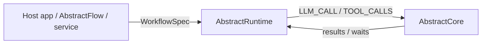
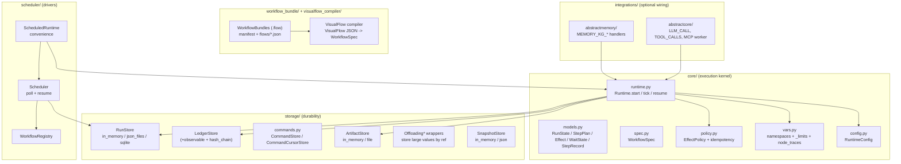
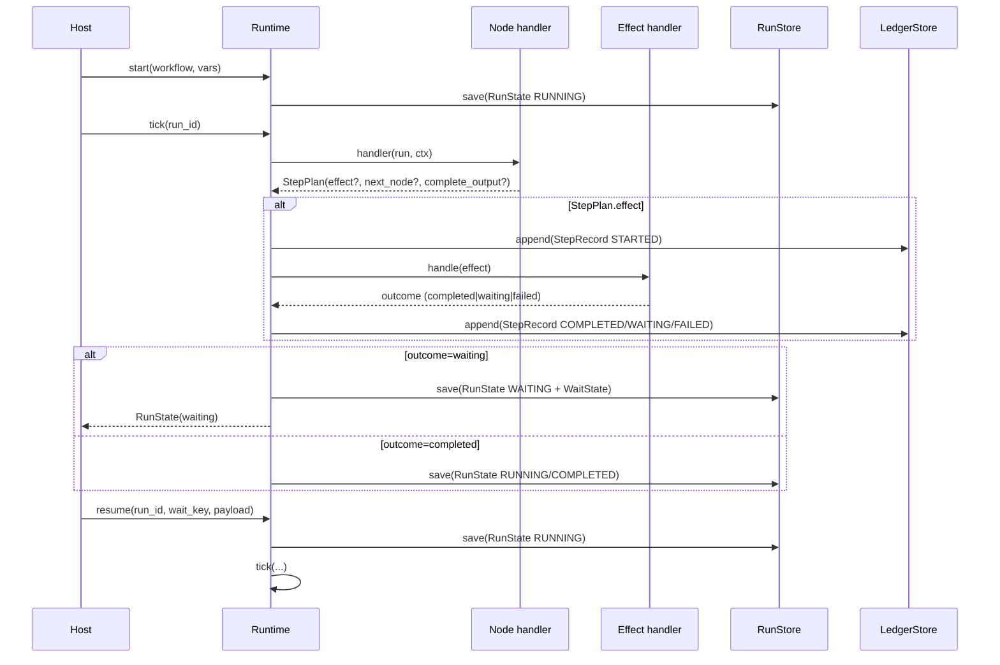

# AbstractRuntime — Architecture

> Updated: 2026-02-09  
> Version: 0.4.2 (see `pyproject.toml`)  
> Scope: this describes **what is implemented in this repository**.

AbstractRuntime is a **durable workflow runtime**: it executes workflow graphs as a persisted state machine with explicit waits (user, time, events, jobs, subworkflows). A run can pause for hours/days and resume **without** keeping Python stacks/coroutines alive.

## Ecosystem (AbstractFramework)

AbstractRuntime is the durable execution kernel inside the wider AbstractFramework ecosystem:
- AbstractFramework umbrella: [lpalbou/AbstractFramework](https://github.com/lpalbou/AbstractFramework)
- AbstractCore (LLM + tools): [lpalbou/abstractcore](https://github.com/lpalbou/abstractcore)

The runtime stays dependency-light and delegates LLM/tool execution to integrations (notably AbstractCore): `src/abstractruntime/integrations/abstractcore/*`.

Key invariants (enforced by code, not convention):
- **Durable state is JSON-safe**: `RunState.vars` must remain JSON-serializable (`src/abstractruntime/core/models.py`). Large payloads should be stored as artifacts and referenced (`src/abstractruntime/storage/artifacts.py`, `src/abstractruntime/storage/offloading.py`).
- **Append-only observability**: every step is recorded as a `StepRecord` in a `LedgerStore` (`src/abstractruntime/core/models.py`, `src/abstractruntime/storage/base.py`).
- **Side effects are mediated**: nodes request work via `Effect`/`EffectType`; execution happens via effect handlers (`src/abstractruntime/core/runtime.py`).

## Component map

## Durable execution model

### WorkflowSpec and node handlers
- A workflow is a `WorkflowSpec` (`src/abstractruntime/core/spec.py`): `workflow_id`, `entry_node`, `nodes: dict[node_id, handler]`.
- A node handler returns a `StepPlan` (`src/abstractruntime/core/models.py`):
  - `effect`: optional side-effect request (`Effect`)
  - `next_node`: move the execution cursor
  - `complete_output`: finish the run

### RunState and the ledger
- `RunState` is the durable checkpoint stored by a `RunStore` (`src/abstractruntime/core/models.py`, `src/abstractruntime/storage/base.py`).
- Each executed step appends a `StepRecord` to a `LedgerStore` (`src/abstractruntime/core/models.py`, `src/abstractruntime/storage/base.py`).

**Invariant:** values stored in `RunState.vars` must be JSON-serializable. Use artifact references for large values (`src/abstractruntime/storage/artifacts.py`) or wrap stores with `OffloadingRunStore` / `OffloadingLedgerStore` (`src/abstractruntime/storage/offloading.py`).

## Runtime loop (start / tick / resume)

Implemented in `src/abstractruntime/core/runtime.py`:

- `Runtime.start(...)` creates a new `RunState` and initializes `_limits` from `RuntimeConfig` (`src/abstractruntime/core/config.py`).
- `Runtime.tick(...)` executes nodes until the run becomes `WAITING`, `COMPLETED`, `FAILED`, or is `CANCELLED`.
- `Runtime.resume(...)` validates the `wait_key`, writes the payload to `WaitState.result_key`, and continues execution **from** `WaitState.resume_to_node`.

## Effects: built-in vs wired by hosts

### Built-in (kernel-owned) effects
Registered in `Runtime._register_builtin_handlers()` (`src/abstractruntime/core/runtime.py`):
- waits: `WAIT_EVENT`, `WAIT_UNTIL`, `ASK_USER`, `ANSWER_USER`
- durable events: `EMIT_EVENT` (resumes matching `WAIT_EVENT` runs; requires `QueryableRunStore` and a workflow registry when listeners exist)
- subworkflows: `START_SUBWORKFLOW` (requires `runtime.workflow_registry`; see `src/abstractruntime/scheduler/registry.py`)
- memory primitives (JSON-safe): `MEMORY_NOTE`, `MEMORY_QUERY`, `MEMORY_TAG`, `MEMORY_COMPACT`, `MEMORY_REHYDRATE`
  - `MEMORY_COMPACT` requires an `ArtifactStore`. It uses an injected `chat_summarizer` when available; otherwise it runs an internal `LLM_CALL` subworkflow and therefore requires an `LLM_CALL` handler to be wired.
- inspection: `VARS_QUERY` (read-only access to `RunState.vars` paths; parsing helpers in `src/abstractruntime/core/vars.py`)

### Host-wired effects
The kernel defines the protocol; concrete integrations provide handlers:
- `LLM_CALL`, `TOOL_CALLS`: provided by AbstractCore integration (`src/abstractruntime/integrations/abstractcore/effect_handlers.py`)
- `MEMORY_KG_*`: provided by the AbstractMemory bridge (`src/abstractruntime/integrations/abstractmemory/effect_handlers.py`)

### Reliability: retries + idempotency
- Policies live in `src/abstractruntime/core/policy.py` (e.g., `RetryPolicy`, `NoRetryPolicy`, `compute_idempotency_key()`).
- The runtime records `idempotency_key` and `attempt` on ledger records (`StepRecord`) and can reuse prior results after restarts (`src/abstractruntime/core/runtime.py`).

## Storage layer

Interfaces: `src/abstractruntime/storage/base.py`.

Included backends:
- in-memory (tests/dev): `src/abstractruntime/storage/in_memory.py`
- filesystem JSON/JSONL: `src/abstractruntime/storage/json_files.py`
- SQLite: `src/abstractruntime/storage/sqlite.py`

Decorators/helpers:
- `ObservableLedgerStore` for in-process subscriptions (`src/abstractruntime/storage/observable.py`, exposed via `Runtime.subscribe_ledger()`)
- `HashChainedLedgerStore` for tamper-evidence (`src/abstractruntime/storage/ledger_chain.py`)
- `ArtifactStore` + helpers (`src/abstractruntime/storage/artifacts.py`)
- `OffloadingRunStore` / `OffloadingLedgerStore` to keep checkpoints bounded (`src/abstractruntime/storage/offloading.py`)
- snapshots/bookmarks (`src/abstractruntime/storage/snapshots.py`)

## Drivers: scheduler

The scheduler is an in-process driver loop that resumes due waits and can deliver external events:
- `Scheduler` (`src/abstractruntime/scheduler/scheduler.py`) polls `QueryableRunStore.list_due_wait_until(...)`
- `ScheduledRuntime` + `create_scheduled_runtime()` (`src/abstractruntime/scheduler/convenience.py`) is the "zero-config" wrapper used in `examples/`

## Observability: what you can export

- Ledger (source of truth): `Runtime.get_ledger(run_id)` (`src/abstractruntime/core/runtime.py`)
- Runtime-owned node traces (bounded): stored at `vars["_runtime"]["node_traces"]` (`src/abstractruntime/core/runtime.py`, helpers in `src/abstractruntime/core/vars.py`)
- Evidence capture for external-boundary tools (`web_search`, `fetch_url`, `execute_command`):
  - recorder: `src/abstractruntime/evidence/recorder.py`
  - API: `Runtime.list_evidence(...)` / `Runtime.load_evidence(...)` (`src/abstractruntime/core/runtime.py`)
- Run history bundle export (portable replay artifact):
  - `export_run_history_bundle(...)` (`src/abstractruntime/history_bundle.py`)

## VisualFlow + WorkflowBundles

AbstractRuntime includes a compiler and a portable bundle format:
- VisualFlow compiler: `src/abstractruntime/visualflow_compiler/*` (VisualFlow JSON -> `WorkflowSpec`)
- WorkflowBundles (`.flow`): `src/abstractruntime/workflow_bundle/*` (manifest + flows + assets)
  - pack/unpack helpers: `pack_workflow_bundle(...)`, `open_workflow_bundle(...)`

## See also
- `../README.md` — install + quick start
- `getting-started.md` — first steps
- `api.md` — public API surface (imports + pointers)
- `limits.md` — `_limits` and RuntimeConfig
- `snapshots.md` — snapshot/bookmark stores
- `provenance.md` — hash chain and verification
- `evidence.md` — artifact-backed evidence capture
- `workflow-bundles.md` — `.flow` bundles + VisualFlow distribution
- `mcp-worker.md` — MCP worker entrypoint (`abstractruntime-mcp-worker`)
- `integrations/abstractcore.md` — AbstractCore wiring
- `manual_testing.md` — end-to-end smoke tests
- `adr/README.md` — rationale (why)
