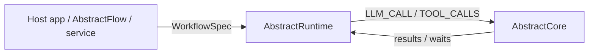
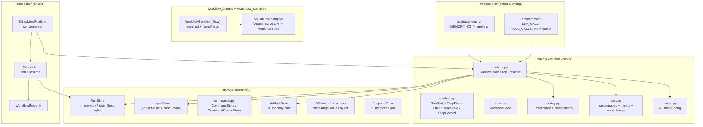
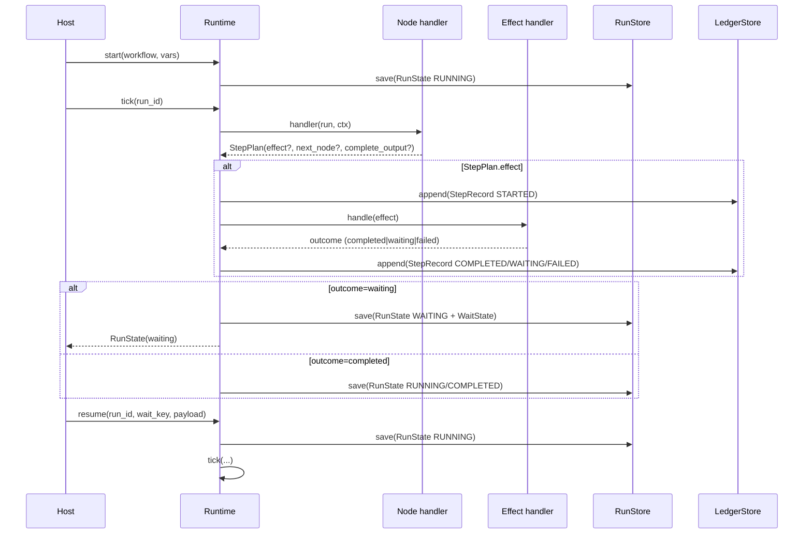

# AbstractRuntime — Architecture

> Updated: 2026-05-23
> Version: 0.4.24
> Scope: this describes **what is implemented in this repository**.

AbstractRuntime is a **durable workflow runtime**: it executes workflow graphs as a persisted state machine with explicit waits (user, time, events, jobs, subworkflows). A run can pause for hours/days and resume **without** keeping Python stacks/coroutines alive.

## Ecosystem (AbstractFramework)

AbstractRuntime is the durable execution kernel inside the wider AbstractFramework ecosystem:
- AbstractFramework umbrella: [lpalbou/AbstractFramework](https://github.com/lpalbou/AbstractFramework)
- AbstractCore (LLM + tools): [lpalbou/abstractcore](https://github.com/lpalbou/abstractcore)

The runtime stays dependency-light and delegates LLM/tool execution to integrations (notably AbstractCore): `src/abstractruntime/integrations/abstractcore/*`. Runtime also depends on the light AbstractMemory contract so `MEMORY_KG_*` effects always have the TripleStore model types available; hosts still choose the concrete memory backend.

```mermaid
flowchart LR
  Host["Host app / AbstractFlow / service"] -->|"WorkflowSpec"| RT["AbstractRuntime"]
  RT -->|"LLM_CALL / TOOL_CALLS"| AC["AbstractCore"]
  AC -->|"results / waits"| RT
```

Key invariants (enforced by code, not convention):
- **Durable state is JSON-safe**: `RunState.vars` must remain JSON-serializable (`src/abstractruntime/core/models.py`). Large payloads should be stored as artifacts and referenced (`src/abstractruntime/storage/artifacts.py`, `src/abstractruntime/storage/offloading.py`).
- **Append-only observability**: every step is recorded as a `StepRecord` in a `LedgerStore` (`src/abstractruntime/core/models.py`, `src/abstractruntime/storage/base.py`).
- **Side effects are mediated**: nodes request work via `Effect`/`EffectType`; execution happens via effect handlers (`src/abstractruntime/core/runtime.py`).

## AbstractCore capability boundary

AbstractRuntime's job is persistence and orchestration. AbstractCore owns model/provider capability execution: chat, structured output, cached sessions/prompt cache, media input analysis, image generation, video generation, voice/audio generation, music generation, and transcription.

The boundary is intentionally narrow:
- Workflow nodes request model work with `EffectType.LLM_CALL`; the runtime persists the request/result and delegates execution to the configured AbstractCore client.
- `media` inputs remain JSON-safe in the effect payload. Artifact refs are materialized into temporary provider-ready files for the call, then cleaned up.
- Generated binary outputs are written to `ArtifactStore` and returned as `artifact_id` / `artifact_ref`, keeping `RunState.vars` and ledger records bounded and JSON-safe.
- Remote chat media is sent to AbstractCore Server as provider-ready content arrays, but persisted provider-request metadata redacts data URLs so checkpoints and ledgers do not embed media bytes.
- Provider sessions and prompt-cache objects are not runtime state. Runtime may carry stable cache keys, while AbstractCore clients/servers manage warm caches.
- Hosts should use Runtime-owned AbstractCore facades for discovery snapshots, prompt-cache/model-residency control operations, and durable run-scoped media/comms child runs instead of reaching through private runtime attachments or importing Core internals directly.
- Local execution can use richer AbstractCore capability plugins. Remote and hybrid execution map the common media cases to AbstractCore Server endpoints and OpenAI-compatible content arrays, while hybrid keeps tool execution local.
- Gateway and other hosts compose Runtime with the desired Core/capability/memory profile. Runtime's base package includes the AbstractMemory contract but not backend extras such as LanceDB; hosts choose storage, embeddings, and readiness policy. Hardware profile extras such as `apple`, `gpu`, `all-apple`, and `all-gpu` cascade through AbstractCore when a host selects them.
- Remote and hybrid clients use explicit Core server URLs and auth headers supplied by the host. Runtime does not read Gateway auth environment variables for provider/model/auth decisions or treat Gateway bearer tokens as Core server/provider credentials.

This keeps the runtime usable by `../abstractgateway` and application layers such as `../abstractflow`, `../abstractassistant`, `../abstractobserver`, and `../abstractcode` without embedding provider-specific model logic in the durable kernel.

## Component map

```mermaid
flowchart TB
  subgraph Core["core/ (execution kernel)"]
    Models["models.py\nRunState / StepPlan / Effect / WaitState / StepRecord"]
    Runtime["runtime.py\nRuntime.start / tick / resume"]
    Spec["spec.py\nWorkflowSpec"]
    Policy["policy.py\nEffectPolicy + idempotency"]
    Vars["vars.py\nnamespaces + _limits + node_traces"]
    Config["config.py\nRuntimeConfig"]
  end

  subgraph Storage["storage/ (durability)"]
    RunStore["RunStore\nin_memory / json_files / sqlite"]
    LedgerStore["LedgerStore\n(+observable + hash_chain)"]
    Commands["commands.py\nCommandStore / CommandCursorStore"]
    Artifacts["ArtifactStore\nin_memory / file"]
    Offload["Offloading* wrappers\nstore large values by ref"]
    Snapshots["SnapshotStore\nin_memory / json"]
  end

  subgraph Scheduler["scheduler/ (drivers)"]
    Registry["WorkflowRegistry"]
    SchedulerMod["Scheduler\npoll + resume"]
    SR["ScheduledRuntime\nconvenience"]
  end

  subgraph Distribution["workflow_bundle/ + visualflow_compiler/"]
    Bundles["WorkflowBundles (.flow)\nmanifest + flows/*.json"]
    Compiler["VisualFlow compiler\nVisualFlow JSON -> WorkflowSpec"]
  end

  subgraph Integrations["integrations/ (optional wiring)"]
    AC["abstractcore/\nLLM_CALL, TOOL_CALLS, MCP worker"]
    AM["abstractmemory/\nMEMORY_KG_* handlers"]
  end

  Runtime --> RunStore
  Runtime --> LedgerStore
  Runtime --> Artifacts
  Runtime --> Policy
  Runtime --> Vars
  Runtime --> Config

  SR --> SchedulerMod
  SR --> Runtime
  SchedulerMod --> RunStore
  SchedulerMod --> Registry

  Bundles --> Compiler
  AC --> Runtime
  AM --> Runtime
```

## Durable execution model

### WorkflowSpec and node handlers
- A workflow is a `WorkflowSpec` (`src/abstractruntime/core/spec.py`): `workflow_id`, `entry_node`, `nodes: dict[node_id, handler]`.
- A node handler returns a `StepPlan` (`src/abstractruntime/core/models.py`):
  - `effect`: optional side-effect request (`Effect`)
  - `next_node`: move the execution cursor
  - `complete_output`: finish the run

### RunState and the ledger
- `RunState` is the durable checkpoint stored by a `RunStore` (`src/abstractruntime/core/models.py`, `src/abstractruntime/storage/base.py`).
- Each executed step appends a `StepRecord` to a `LedgerStore` (`src/abstractruntime/core/models.py`, `src/abstractruntime/storage/base.py`).

**Invariant:** values stored in `RunState.vars` must be JSON-serializable. Use artifact references for large values (`src/abstractruntime/storage/artifacts.py`) or wrap stores with `OffloadingRunStore` / `OffloadingLedgerStore` (`src/abstractruntime/storage/offloading.py`).

## Runtime loop (start / tick / resume)

Implemented in `src/abstractruntime/core/runtime.py`:

- `Runtime.start(...)` creates a new `RunState` and initializes `_limits` from `RuntimeConfig` (`src/abstractruntime/core/config.py`).
- `Runtime.tick(...)` executes nodes until the run becomes `WAITING`, `COMPLETED`, `FAILED`, or is `CANCELLED`.
- `Runtime.resume(...)` validates the `wait_key`, writes the payload to `WaitState.result_key`, and continues execution **from** `WaitState.resume_to_node`.

```mermaid
sequenceDiagram
  participant Host
  participant RT as Runtime
  participant Node as Node handler
  participant EH as Effect handler
  participant RS as RunStore
  participant LS as LedgerStore

  Host->>RT: start(workflow, vars)
  RT->>RS: save(RunState RUNNING)

  Host->>RT: tick(run_id)
  RT->>Node: handler(run, ctx)
  Node-->>RT: StepPlan(effect?, next_node?, complete_output?)

  alt StepPlan.effect
    RT->>LS: append(StepRecord STARTED)
    RT->>EH: handle(effect)
    EH-->>RT: outcome (completed|waiting|failed)
    RT->>LS: append(StepRecord COMPLETED/WAITING/FAILED)
  end

  alt outcome=waiting
    RT->>RS: save(RunState WAITING + WaitState)
    RT-->>Host: RunState(waiting)
  else outcome=completed
    RT->>RS: save(RunState RUNNING/COMPLETED)
  end

  Host->>RT: resume(run_id, wait_key, payload)
  RT->>RS: save(RunState RUNNING)
  RT->>RT: tick(...)
```

## Effects: built-in vs wired by hosts

### Built-in (kernel-owned) effects
Registered in `Runtime._register_builtin_handlers()` (`src/abstractruntime/core/runtime.py`):
- waits: `WAIT_EVENT`, `WAIT_UNTIL`, `ASK_USER`, `ANSWER_USER`
- durable events: `EMIT_EVENT` (resumes matching `WAIT_EVENT` runs; requires `QueryableRunStore` and a workflow registry when listeners exist)
- subworkflows: `START_SUBWORKFLOW` (requires `runtime.workflow_registry`; see `src/abstractruntime/scheduler/registry.py`)
- memory primitives (JSON-safe): `MEMORY_NOTE`, `MEMORY_QUERY`, `MEMORY_TAG`, `MEMORY_COMPACT`, `MEMORY_REHYDRATE`
  - `MEMORY_COMPACT` requires an `ArtifactStore`. It uses an injected `chat_summarizer` when available; otherwise it runs an internal `LLM_CALL` subworkflow and therefore requires an `LLM_CALL` handler to be wired.
- inspection: `VARS_QUERY` (read-only access to `RunState.vars` paths; parsing helpers in `src/abstractruntime/core/vars.py`)

### Host-wired effects
The kernel defines the protocol; concrete integrations provide handlers:
- `LLM_CALL`, `TOOL_CALLS`, `MODEL_RESIDENCY`: provided by AbstractCore integration (`src/abstractruntime/integrations/abstractcore/effect_handlers.py`). The integration supports local/remote/hybrid execution, cached sessions/prompt-cache control, discovery/catalog snapshots, model residency, durable run-scoped media child runs, media inputs, generated media outputs, provider progress callbacks as ledger events, provider-key header routing for remote servers, passthrough tools, and approval-gated local tool execution.
- `MEMORY_KG_*`: provided by the AbstractMemory bridge (`src/abstractruntime/integrations/abstractmemory/effect_handlers.py`)

### Reliability: retries + idempotency
- Policies live in `src/abstractruntime/core/policy.py` (e.g., `RetryPolicy`, `NoRetryPolicy`, `compute_idempotency_key()`).
- The runtime records `idempotency_key` and `attempt` on ledger records (`StepRecord`) and can reuse prior results after restarts (`src/abstractruntime/core/runtime.py`).

## Storage layer

Interfaces: `src/abstractruntime/storage/base.py`.

Included backends:
- in-memory (tests/dev): `src/abstractruntime/storage/in_memory.py`
- filesystem JSON/JSONL: `src/abstractruntime/storage/json_files.py`
- SQLite: `src/abstractruntime/storage/sqlite.py`

Decorators/helpers:
- `ObservableLedgerStore` for in-process subscriptions (`src/abstractruntime/storage/observable.py`, exposed via `Runtime.subscribe_ledger()`)
- `HashChainedLedgerStore` for tamper-evidence (`src/abstractruntime/storage/ledger_chain.py`)
- `ArtifactStore` + helpers (`src/abstractruntime/storage/artifacts.py`)
- `OffloadingRunStore` / `OffloadingLedgerStore` to keep checkpoints bounded (`src/abstractruntime/storage/offloading.py`)
- snapshots/bookmarks (`src/abstractruntime/storage/snapshots.py`)

## Drivers: scheduler

The scheduler is an in-process driver loop that resumes due waits and can deliver external events:
- `Scheduler` (`src/abstractruntime/scheduler/scheduler.py`) polls `QueryableRunStore.list_due_wait_until(...)`
- `ScheduledRuntime` + `create_scheduled_runtime()` (`src/abstractruntime/scheduler/convenience.py`) is the "zero-config" wrapper used in `examples/`

## Observability: what you can export

- Ledger (source of truth): `Runtime.get_ledger(run_id)` (`src/abstractruntime/core/runtime.py`)
- Runtime-owned node traces (bounded): stored at `vars["_runtime"]["node_traces"]` (`src/abstractruntime/core/runtime.py`, helpers in `src/abstractruntime/core/vars.py`)
- Evidence capture for external-boundary tools (`web_search`, `fetch_url`, `execute_command`):
  - recorder: `src/abstractruntime/evidence/recorder.py`
  - API: `Runtime.list_evidence(...)` / `Runtime.load_evidence(...)` (`src/abstractruntime/core/runtime.py`)
- Run history bundle export (portable replay artifact):
  - `export_run_history_bundle(...)` (`src/abstractruntime/history_bundle.py`)

## VisualFlow + WorkflowBundles

AbstractRuntime includes a compiler and a portable bundle format:
- VisualFlow compiler: `src/abstractruntime/visualflow_compiler/*` (VisualFlow JSON -> `WorkflowSpec`)
- Multi-entry VisualFlow authoring routes are lowered into internal `join_exec` and `path_mux` nodes when a target has multiple incoming `exec-in` edges plus per-route input overrides. This keeps authoring JSON clean while making runtime behavior explicit and restart-safe. See `workflow-bundles.md` for the concrete metadata shape.
- WorkflowBundles (`.flow`): `src/abstractruntime/workflow_bundle/*` (manifest + flows + assets)
  - pack/unpack helpers: `pack_workflow_bundle(...)`, `open_workflow_bundle(...)`

## See also
- `../README.md` — install + quick start
- `getting-started.md` — first steps
- `api.md` — public API surface (imports + pointers)
- `limits.md` — `_limits` and RuntimeConfig
- `snapshots.md` — snapshot/bookmark stores
- `provenance.md` — hash chain and verification
- `evidence.md` — artifact-backed evidence capture
- `workflow-bundles.md` — `.flow` bundles + VisualFlow distribution
- `mcp-worker.md` — MCP worker entrypoint (`abstractruntime-mcp-worker`)
- `integrations/abstractcore.md` — AbstractCore wiring
- `manual_testing.md` — end-to-end smoke tests
- `adr/README.md` — rationale (why)
