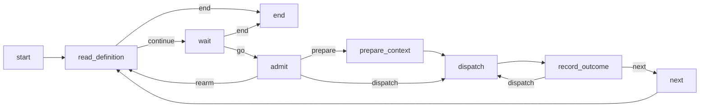

# Automations

An automation runs a workflow again and again on a trigger: "check the price of ACME every 5 minutes", "report this
machine's memory use every 2 minutes", "run this report when I ask". AbstractRuntime runs automations itself, as
ordinary durable runs. A host (the gateway) exposes them to clients, but a runtime and a store are enough to run one.

- An automation **is** a durable root run, the *controller*. Its run id is the automation id.
- Each firing is an **occurrence**: a child run of the controller, created with a deterministic id. At most one
  occurrence runs at a time.
- Triggers are pluggable **trigger sources**. The runtime ships `schedule@1` and `manual@1`, and other packages can
  add their own.
- Every change (admission, dispatch, completion, command) is an `automation.*` record in the controller's ledger. A
  crash at any point never loses an occurrence and never starts one twice.

Code: `abstractruntime.automations` (controller, commands, service API) and `abstractruntime.triggers` (sources).

## Quick start

```python
from abstractruntime import Runtime
from abstractruntime.automations import create_automation, drive_automation, register_controller_bundle
from abstractruntime.scheduler.registry import WorkflowRegistry
from abstractruntime.storage.sqlite import SqliteDatabase, SqliteLedgerStore, SqliteRunStore

db = SqliteDatabase("automations.sqlite")
registry = WorkflowRegistry()
registry.register(my_memory_check_workflow)      # the target: any WorkflowSpec
register_controller_bundle(registry)              # the shipped controller flow
runtime = Runtime(run_store=SqliteRunStore(db), ledger_store=SqliteLedgerStore(db), workflow_registry=registry)

automation_id, revision = create_automation(runtime, {
    "request_id": "memory-watch-1",               # replaying the same request finds the same automation
    "title": "Memory watch",
    "target": {"workflow_id": my_memory_check_workflow.workflow_id, "bundle_ref": "local@0.0.0",
               "flow_id": "memory_check", "input_data": {"prompt": "Report memory use; notify me above 90%."}},
    "trigger": {"source_id": "schedule", "source_version": 1, "config": {"every": "2m"}},
    "workspace_root": "/Users/me/automations/memory-watch",
})
drive_automation(runtime, automation_id)          # standalone hosts; the gateway drives runs itself
```

`drive_automation` ticks the controller and its current occurrence, then resumes the controller when the occurrence
ends. It returns when the controller parks. Hosts with their own run loop (the gateway) do not need it: the
controller is an ordinary run that waits on an event with a deadline, and on its occurrence like any subworkflow
parent.

## The definition

The definition is stored in `vars._meta.automation` of the controller run, and each change creates a new revision.
Unknown fields are rejected everywhere.

| Field | Meaning |
|---|---|
| `schema_version` | `1` |
| `revision` | starts at 1; each `automation.revise` adds 1 |
| `title` | non-empty, at most 120 characters |
| `controller` | `{bundle_ref: "abstractframework.automation-controller@1.0.0", flow_id: "controller"}` |
| `target` | `{workflow_id, bundle_ref, flow_id, input_data}`: a concrete workflow (hosts resolve `@default` first) |
| `trigger` | `{binding_id, source_id, source_version, config}` (the binding id is created by the runtime) |
| `context` | `{mode: "independent" \| "growing", growing: {}}`; `growing.summary` is `unsupported_feature` in v1 |
| `policy` | `{serial: true, misfire: "coalesce", failure: "continue", retry: {max_attempts: 3, backoff: {initial: "30s", factor: 2, max: "10m"}}, tool_approval: "auto"}` |
| `session_id` | `automation:<automation_id>` |
| `workspace_root` | absolute path given to every occurrence |
| `created_at`, `archived_at` | UTC timestamps; `archived_at` is `null` until archived |

The creation request is `{request_id, title, target, trigger: {source_id, source_version, config}, context?,
policy?: {retry?, tool_approval?}, workspace_root, tenant?, user?}`. The automation id is `uuid5(AUTOMATION_NAMESPACE,
"<tenant>:<user>:<request_id>")`. Sending the same request again returns the same automation. Reusing a
`request_id` with a different request fails with `identity_conflict`.

`create_automation(runtime, request, *, now=None, actor_id=None)` and `start_discussion(..., actor_id=None)` stamp
`actor_id` (the owner) on the root run in the same create-if-absent step.

Validation failures raise `AutomationError`, whose `reason_code` is one of `invalid_definition`,
`unsupported_feature` or `unknown_trigger_source`, and whose `field` names the offending field.

## Triggers

A trigger source is an adapter with six methods (`validate`, `initial_state`, `prepare`, `admit`, `rearm`,
`normalize`, see `abstractruntime.triggers.protocol`). It reads persisted state and the time passed in, and never
does I/O. `trigger_sources()` lists every source; `get_trigger_adapter(id, version)` returns an available one.

### `schedule@1`

Config: `{start_at?, every?, until?, count?, anchor?}`.

- `every` is a whole number followed by `s`, `m`, `h` or `d` (`^[1-9][0-9]*[smhd]$`), at most `366d`. Units have fixed lengths in UTC,
  so there are no months and no daylight-saving shifts: "every 24 hours" is exactly 24 hours. Write weeks as `7d`.
- Ticks sit on a fixed grid, `T_k = anchor + k·every`. They do not drift: an occurrence that starts 7 seconds late
  does not move the next tick. `start_at` defaults to the creation time, and `anchor` must equal `start_at` in v1.
- `until` is exclusive. `count` (1 to 1 000 000) counts scheduled admissions; manual runs and retries do not
  count.
- Without `every`, the automation fires once, at `start_at`, and then stops.
- Missed ticks are **coalesced**. When several ticks are due at once (downtime, or a long occurrence), one
  occurrence runs, for the latest due tick. Its event payload is `{tick, scheduled_at, coalesced: {first_tick,
  last_tick, missed_count}}`, and an `automation.coalesced` record is written to the ledger.
- A revision that changes the trigger gets a new `binding_id`, so the new schedule never reuses an old event id.

### `manual@1`

Config: `{}`. The automation runs only when asked (`automation.run_now`). A manual run of any automation, whatever
its trigger, carries a `manual` envelope with event id `manual:<command_id>`.

### Adding a source

Declare the source in the entry-point group `abstractruntime.trigger_sources`:

```toml
[project.entry-points."abstractruntime.trigger_sources"]
webhook = "my_package.triggers:WebhookTriggerAdapter"
```

The entry-point name must equal `descriptor.id`. A third-party source that fails to load is listed with
`available: false` and a reason; it cannot be selected, and the other sources keep working. The built-in sources are
required: if one is missing or broken, discovery raises `TriggerRegistryError`.

## How the controller works

The controller is the packaged VisualFlow bundle `abstractframework.automation-controller@1.0.0` (package data under
`automations/bundles/`). Its root runs keep the workflow id `abstractframework.automation-controller@1.0.0:controller`,
so a restarted host resolves this exact version. `controller_bundle_path()` returns the directory for hosts that load
bundles from disk, and `controller_workflow_spec()` returns the compiled flow.



- **read_definition** starts using the latest revision. When the automation is archived or its trigger is exhausted,
  and nothing is running, the controller ends.
- **wait** parks on one `WAIT_EVENT` with key `automation:<id>:wake`. Its deadline is the next tick or the retry time;
  there is no deadline while paused or for a manual trigger. Commands wake this wait. A wake only makes the
  controller re-read its persisted state, so a stale wake never starts an extra occurrence.
- **admit** admits an occurrence only for a scheduled tick that is due while the automation is not paused, or for a
  pending manual run. At admission it freezes the occurrence's inputs (`prepared`: workflow, session, workspace,
  input data), the trigger envelope and the retry policy. Every attempt uses these, so a later revision cannot change
  an occurrence that has already started.
- **dispatch** records the attempt and starts the child with `START_SUBWORKFLOW {async: true, wait: true, run_id}`.
  The child runs outside the controller's tick, driven by the host, and the controller waits for it like any
  subworkflow parent. The child id is deterministic, and the child is created only if absent, so replaying a
  dispatch after a crash re-attaches to the same child.
- **record_outcome** reloads the child and reads its output (it never relies on the resume payload). Success
  completes the occurrence. A failure schedules a retry while attempts remain; otherwise it completes as `failed`.

The run's mutation lock (`run_mutation_lock`) is held for the whole controller tick and for every command, so
commands and controller steps never interleave. v1 supports one controller-writer process per store.

### Occurrences

| | Independent (default) | Growing |
|---|---|---|
| Session | a fresh session per occurrence (its first attempt's run id) | the automation's session (`automation:<id>`) |
| History | none | the prior turns, up to 40 messages / 24 000 characters, as `context.messages` |
| `_meta.occurrence.session_kind` | `occurrence` | `automation` |

In growing mode, history is read strictly: if the history cannot be read, the admission fails loudly instead of
running without context.

Each occurrence run carries `vars._meta.occurrence = {automation_id, occurrence_index, attempt, event_id, revision,
role: "occurrence", session_kind, fired_at, trigger_envelope}`, and its descendants carry `role: "descendant"`. When
the target's `input_data.prompt` is a string, it is prefixed with
`[Trigger schedule@1 · occurrence 3 · fired 2026-…]` on its own line, and the result is the occurrence's user turn.

Child ids: `uuid5(automation_id, "<revision>:<index>")` for a scheduled occurrence and
`uuid5(automation_id, "manual:<command_id>")` for a manual one. Retry attempt `n ≥ 2` appends `":a<n>"`.

### Retries

`policy.retry` defaults to 3 attempts in total. The delay before attempt `n + 1` is
`min(initial · factor^(n−1), max)`: by default 30 s, then 60 s, with a cap of 10 minutes. Each attempt is its own
child run with the frozen inputs. An `automation.retry_scheduled` record marks each backoff, and
`automation.completed` carries `attempts`. Retries do not make external effects exactly-once: a target that sends an
email may send it again when it is retried.

## Tool approval

`policy.tool_approval` decides whether the target's tools may run without asking:

- `"auto"` (the default): an automation runs unattended, so it cannot ask a person before every tool call.
  **Creating the automation is the consent**: client forms state that its tools run without asking and list them.
  At admission, the runtime freezes into the occurrence's inputs the runtime's existing per-run grant,
  `_runtime.tool_policy = {auto_approve_tools: [...], source: "automation-policy"}`. Child runs inherit it. The
  tools named are the target's explicit `_runtime.allowed_tools` when it has that list, and otherwise every tool the
  runtime can expose (`TOOL_EFFECT_CLASSES`). Naming a tool outside the run's tool ceiling grants nothing, and a tool
  outside that table (a third-party MCP tool, for example) still asks. A `tool_policy` that the target's own
  `input_data` already carries is left untouched.
- `"ask"`: no grant. Tool calls that need approval wait on a `tool_approval` wait, as in a chat.

The grant is frozen with the rest of the occurrence's inputs: a revision of `tool_approval` applies from the next
occurrence and never changes one already admitted. Questions a flow asks a person (`ask_user`) still wait in both
modes. Discussions never inherit the grant: they approve tools interactively, like any chat.

## Waits on a person

`pending_waits(run_store, automation_id)` lists the occurrence runs that are waiting on a person. Each wait has a
type, read from the wait record's structure and never from its text:

```text
{run_id, wait_key, kind: "ask_user" | "tool_approval" | "event", reason, index, prompt?, choices?, details?}
```

| `kind` | When | Answer with `Runtime.resume(run_id=..., wait_key=..., payload=...)` |
|---|---|---|
| `ask_user` | a `USER` wait that is not a pause (a question from the flow) | `{response: "..."}` |
| `tool_approval` | a tool batch waiting for approval (`details.mode == "approval_required"`) | `{approved: true}` or `{approved: false}` |
| `event` | an `EVENT` wait carrying a prompt or choices | `{payload: ...}` |

`details` depends on the kind: for `tool_approval` it is the list of calls that approving will run,
`[{name, arguments, call_id?}]`; for `event` it is `{scope, name}` when the wait uses the runtime's event key; an
`ask_user` wait has none (its `prompt` and `choices` say everything).
Paused runs and the controller's own wake wait are never listed. `ANSWER_PAYLOADS` and `wait_kind(run)` expose the
same mapping to hosts.

## Commands

`apply_automation_command(runtime, *, automation_id, command_id, type, payload=None, actor=None,
expected_revision=None)` is the only way to change an automation. It returns `{status: "applied" | "rejected",
error?, duplicate}` and never raises for a rejection.

| Type | Effect |
|---|---|
| `automation.pause` | stops **scheduled** admissions. The current occurrence and its retries finish; `run_now` still works. This is not the runtime's pause gate. |
| `automation.resume` | re-arms at the first tick after now. It never fires on resume and never catches up the paused time. |
| `automation.run_now` | runs once at the next controller step, even while paused (the automation stays paused). Rejected with `automation_busy` while an occurrence or a manual run is pending, and with `invalid_state` when archived or exhausted. There is no queue. |
| `automation.revise` | `payload.changes = {title?, target?, trigger?, context?, policy?}`; each field is replaced whole, except `policy`, whose fields are merged (a field you do not send keeps its value, so a retry-only change never resets `tool_approval`). It creates the next revision, which the controller uses from its next step. A changed trigger is re-armed after now, so no past tick fires. |
| `automation.stop_current` | cancels the running occurrence tree, or its pending retry. The occurrence completes as `cancelled`, quietly. `invalid_state` when nothing is running. |
| `automation.archive` | stops further admissions; the current occurrence finishes and then the controller ends. History is kept. |

Repeating a command whose state already holds is an `applied` no-op. `expected_revision` is checked when the command
is applied; a mismatch is rejected with `revision_conflict`.

Commands are idempotent per `command_id`. The `automation.command_result` record is the decision, keyed
`automation:command_result:<automation_id>:<command_id>`. Replaying a command returns the recorded result with
`duplicate: true`, and only re-runs the follow-ups that are safe to repeat. A `command_id` is tied to its whole command
(type, payload and `expected_revision`): reusing it for a different command is rejected with `identity_conflict`
(field `command_id`), and nothing is recorded. The safe-to-repeat follow-ups are: the observation record
(`automation.paused`, `resumed`, `revised`, `archived`), waking the controller, and cancelling the child. Hosts
record their own failures with `record_automation_command_result(...)`.

### Crash safety

Each transition, whether a command or a controller step, is a *decision*:

1. Reconcile any unfinished decision.
2. Look up the decision's key exactly (`find_by_idempotency_key`). If it exists, the decision was already made, and
   nothing new is appended.
3. Decide from the persisted state.
4. Save the intent (`_runtime.automation.intent`).
5. Append the record, which carries the full state change and `state_version`.
6. Apply the change and save.

After a crash, the next step either applies the recorded change or drops the intent. So a crash at any point leaves
exactly one record and one application. The tests inject a crash at every one of these points, on both the SQLite
and the JSON stores.

## Notifications and attention

Automations are **quiet by default**. An occurrence needs your attention only when:

- its output carries `notify: true`: the item's title is the automation title and its body is the answer (at most
  280 characters);
- its output carries `notify: {title, body}` (title at most 120, body at most 2000 characters). A missing, `false` or
  empty `notify` stays quiet;
- it **failed after its last retry**. A failure that a retry fixed is quiet, and so is a cancelled occurrence;
- it is waiting on a person (see [Waits on a person](#waits-on-a-person)). `pending_waits` reports these live;
  they are not attention items.

The output is read by structure. An agent-interface target ends with `response`/`success`/`meta`; a plain flow ends
with its end-node pins or `{success, result}`. A workflow that must flag a result adds `notify` to what it returns.

Each notify or final failure creates exactly one attention item per occurrence, carried by its
`automation.completed` record with a per-automation sequence number. `list_attention(ledger_store, automation_id, *,
after_seq=0, cursor=None, limit=50)` pages these items oldest first; cursors look like `att1:<seq>`. A client should
acknowledge only the cursor of the last item it displayed, so items it never showed stay unseen.

## Discussing an occurrence

`start_discussion(runtime, *, automation_id, occurrence_index, request_id, prompt)` forks a conversation from an
occurrence:

- It starts a new **root** run (`uuid5(automation_id, "discuss:<request_id>")`) in its own session,
  `discussion-session:<that run id>`, so request ids are scoped to the automation. The same request returns the
  same discussion; the same `request_id` with a different request on that automation is rejected with
  `identity_conflict`.
- The run uses the occurrence's workflow, its frozen inputs, and `prompt` as the new user turn.
- It is seeded **once** with the automation's conversation up to and including that occurrence. The seed is stored
  in `_meta.discussion.seed_messages` and comes first in the discussion's later history.
- The occurrence's workspace is mounted **read-only** (`workspace_read_only: true`). Reads work; writes, edits and
  command execution are refused.
- Nothing is ever written back into the automation's session, state or ledger.

## Reading automations

- `get_automation(run_store, automation_id)`: the definition, active revision, state, status (`active`, `paused`,
  `completed`, `failed` or `archived`) and `next_fire_at`.
- `list_occurrences(runtime, automation_id, *, cursor=None, limit=50)`: occurrences, newest first, built from the
  ledger (status, attempts, child run ids, envelope, notify, attention).
- `list_attention(...)` and `pending_waits(...)`: see [Notifications and attention](#notifications-and-attention).
- `adopt_legacy_schedule_projection(run)`: a read-only summary of a legacy `scheduled:*` gateway root, marked
  `legacy: true`. Legacy roots are never migrated.
- The run index (`list_run_index(automation_id=, role=, session_kind=)`, `list_automations`, `latest_occurrence`) lets
  hosts list automations without loading run payloads.

Reading history is a pure read: it makes no provider or tool calls and writes nothing.
