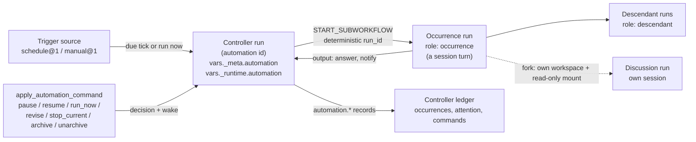
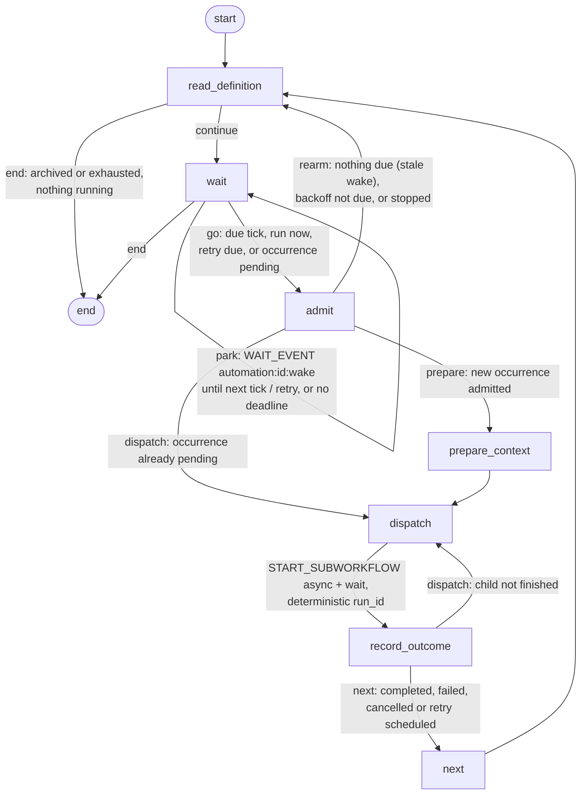

# Automations

An automation runs a workflow again and again on a trigger: "check the price of ACME every 5 minutes", "report this
machine's memory use every 2 minutes", "run this report when I ask". AbstractRuntime runs automations itself, as
ordinary durable runs, so a runtime and a run store are enough to run one. A host such as AbstractGateway exposes them
over HTTP and drives them in its run loop.

This page covers the model, the definition, triggers, the controller, commands, context, discussions, tool approval,
notifications and the storage guarantees automations rely on. For the surrounding runtime concepts see
[architecture.md](architecture.md); for the import surface see [api.md](api.md#automations).

Code: `abstractruntime.automations` (controller, commands, service API), `abstractruntime.triggers` (trigger
sources), `abstractruntime.automation_queries` (listing), `abstractruntime.session_turns` and
`abstractruntime.session_history` (what counts as a turn and how history is replayed).

## Mental model

- **An automation is a run.** It is a durable root run, the *controller*, that executes the packaged flow
  `abstractframework.automation-controller@1.0.0`. The controller's run id is the automation id.
- **Each firing is an occurrence.** An occurrence is a child run of the controller with a deterministic id. At most
  one occurrence runs at a time. Its child runs (tools, subworkflows) are its *descendants*.
- **Occurrences are turns.** In the session views and history the runtime builds, an occurrence counts as one
  conversation turn: its prompt is the user turn and its answer is the assistant turn.
- **Context is independent or growing.** By default each occurrence starts fresh in its own session. In growing mode
  every occurrence joins the automation's session and sees the previous ones as history.
- **Automations are quiet.** An occurrence asks for attention only when its output says `notify`, when it still
  fails after its last retry, or while it waits on a person.
- **Creating an automation is consent for its tools.** With the default `tool_approval: "auto"` an occurrence's tools
  run without asking, except messages to anyone but the registered user (those wait for approval); set `"ask"` to
  approve every batch.
- **Everything is recorded.** Every admission, dispatch, retry, completion and command is an `automation.*` record in
  the controller's ledger. A crash at any point never loses an occurrence and never starts one twice.



## Quick start

```python
import os

from abstractruntime import Runtime
from abstractruntime.automations import (
    controller_workflow_spec,
    create_automation,
    drive_automation,
    register_controller_bundle,
)
from abstractruntime.scheduler.registry import WorkflowRegistry
from abstractruntime.storage.sqlite import SqliteDatabase, SqliteLedgerStore, SqliteRunStore

db = SqliteDatabase("automations.sqlite")
registry = WorkflowRegistry()
registry.register(memory_check)                   # the target: any WorkflowSpec
register_controller_bundle(registry)              # the packaged controller flow
runtime = Runtime(run_store=SqliteRunStore(db), ledger_store=SqliteLedgerStore(db), workflow_registry=registry)

automation_id, revision = create_automation(runtime, {
    "request_id": "memory-watch-1",               # the same request finds the same automation
    "title": "Memory watch",
    "target": {"workflow_id": memory_check.workflow_id, "bundle_ref": "local@0.0.0",
               "flow_id": "memory_check", "input_data": {"prompt": "Report memory use; notify me above 90%."}},
    "trigger": {"source_id": "schedule", "source_version": 1, "config": {"every": "2m"}},
    "workspace_root": os.path.abspath("automations/memory-watch"),
})
drive_automation(runtime, automation_id)          # runs occurrence 1 now, then parks until the next tick
```

Without `start_at`, the schedule starts at creation time, so the first occurrence runs on the controller's first
step. `drive_automation` ticks the controller and its current occurrence, resumes the controller when the occurrence
ends, and returns when the controller parks (on its wake wait, or on an occurrence that waits on a person).

To fire later ticks without a host loop, tick the controller once its deadline has passed (a due wake wait is
released by `Runtime.tick`) and drive it again:

```python
runtime.tick(workflow=controller_workflow_spec(), run_id=automation_id)
drive_automation(runtime, automation_id)
```

A host with its own run loop does not need `drive_automation`: the controller is an ordinary run that waits on an
event with a deadline (listed by `list_due_wait_until`), and waits on its occurrence like any asynchronous
subworkflow parent.

## The definition

The definition is stored in `vars._meta.automation` of the controller run. Every change creates a new revision, and
unknown fields are rejected at every level.

| Field | Meaning |
|---|---|
| `schema_version` | `2` (a stored `1` reads with the defaults of the v2 fields and becomes `2` at its next revision) |
| `revision` | starts at 1; each applied `automation.revise` adds 1 |
| `title` | non-empty, at most 120 characters |
| `controller` | `{bundle_ref: "abstractframework.automation-controller@1.0.0", flow_id: "controller"}` |
| `target` | `{workflow_id, bundle_ref, flow_id, input_data}`: a concrete workflow; a host resolves `@default` before creating (`flow_id: "@default"` is refused) |
| `trigger` | `{binding_id, source_id, source_version, config}`; the runtime creates `binding_id` |
| `context` | `{mode: "independent" \| "growing", growing: {}}` |
| `policy` | `{serial: true, misfire: "coalesce", failure: "continue", retry, tool_approval, email_allowed_recipients, untrusted_input_tools}` |
| `notify` | `{channels: ["console"] \| ["console", "email"]}`: where attention items are delivered (default `["console"]`) |
| `session_id` | `automation:<automation_id>` |
| `workspace_root` | absolute path given to every occurrence |
| `created_at`, `archived_at` | UTC timestamps; `archived_at` is `null` until the automation is archived |

`policy.retry` is `{max_attempts, backoff: {initial, factor, max}}`, by default
`{max_attempts: 3, backoff: {initial: "30s", factor: 2, max: "10m"}}`. `max_attempts` is 1 to 10, `factor` is 1 to 10,
and `initial` and `max` are durations (see [`schedule@1`](#schedule1)). `serial`, `misfire` and `failure` accept only
the values shown; anything else is refused with `unsupported_feature`. `policy.tool_approval` is `"auto"` (default) or
`"ask"`, see [Tool approval](#tool-approval). `policy.email_allowed_recipients` lists who occurrences may email
without an approval wait: `"self"` (the user's registered address) and exact addresses, at most 50, default
`["self"]`; display names, domains and patterns are refused. A revision that changes other policy fields keeps it.
`policy.untrusted_input_tools` (default `[]`, at most 20) names, one by one, tools that an occurrence of an untrusted
trigger (`email.received@1`) may run without asking although "allow all tools" does not cover them there (a tool
that reaches the network, runs code or commands, writes outside the workspace or delegates), for example
`["fetch_url"]`; `"all"` and patterns are refused, and message-sending tools are never granted this way. See
[Tool approval](#tool-approval).

### Creating an automation

`create_automation(runtime, request, *, now=None, actor_id=None) -> (automation_id, revision)`.

The request is `{request_id, title, target, trigger: {source_id, source_version, config}, context?, policy?,
notify?, workspace_root, tenant?, user?}`.

- The automation id is `uuid5(AUTOMATION_NAMESPACE, "<tenant>:<user>:<request_id>")`; `tenant` and `user` default to
  `local`. Sending the same request again returns the same automation, unchanged. Reusing a `request_id` for a
  different request raises `AutomationError` with `reason_code = "identity_conflict"`.
- `actor_id` (the owner) is stamped on the controller run in the same create-if-absent step.
- An `automation.created` record is written once.
- Validation failures raise `AutomationError`. Its `reason_code` is `invalid_definition`, `unsupported_feature` or
  `unknown_trigger_source`, and its `field` names the offending field (`trigger.config.every`, for example).
- `context.growing.summary` is refused with `unsupported_feature`: automatic summaries of growing history are not part
  of v1.

## Triggers

A trigger source is an adapter with six methods (`validate`, `initial_state`, `prepare`, `admit`, `rearm`,
`normalize`; see `abstractruntime.triggers.protocol`). It reads persisted state and the time it is given, and never
does I/O, so the controller, the command applier and tests always get the same answer for the same inputs.

`trigger_sources()` lists every discovered source as `{descriptor, available, unavailable_reason?, name?}`. Each
descriptor carries `id`, `version`, `label`, `config_schema`, `event_schema` and `capabilities.kind` (`time`,
`manual` or `event`). `get_trigger_adapter(id, version)` returns an available source or raises
`UnknownTriggerSource`.

### `schedule@1`

Config: `{start_at?, every?, until?, count?, anchor?}`.

- Timestamps are RFC 3339 with an explicit offset (`2026-10-01T08:00:00Z`); a timestamp without an offset is refused.
- `every` is a whole number followed by `s`, `m`, `h` or `d` (`^[1-9][0-9]*[smhd]$`), at most `366d`. Units have
  fixed lengths in UTC, so there are no months and no daylight-saving shifts: `24h` is exactly 24 hours. Write weeks
  as `7d`.
- Ticks sit on a fixed grid, `T_k = anchor + k·every` (k = 0, 1, ...). They do not drift: an occurrence that starts
  7 seconds late does not move the next tick.
- `start_at` defaults to the creation time, and the first tick is `start_at` itself. `anchor` must equal `start_at`
  in v1.
- `until` is exclusive and must be after `start_at`. `count` (1 to 1,000,000) counts scheduled admissions; manual
  runs and retries do not count. `count` greater than 1 requires `every`.
- Without `every`, the automation fires once, at `start_at`, and is then exhausted.
- Missed ticks are **coalesced**. When several ticks are due at once (downtime, or a long occurrence), one occurrence
  runs, for the latest due tick. Its event payload is `{tick, scheduled_at, coalesced: {first_tick, last_tick,
  missed_count}}`, and an `automation.coalesced` record is written.
- The event id of a scheduled tick is `schedule@1:<binding_id>:<tick>`. A revision that changes the trigger gets a
  new `binding_id`, so the new schedule never reuses an old event id.

### `manual@1`

Config: `{}`. The automation runs only when asked with `automation.run_now`. A manual run of any automation, whatever
its trigger, carries a `manual` envelope with event id `manual:<command_id>`.

### `email.received@1`

Runs the automation when mail arrives in the user's mailbox, in batches no more often than `config.every` (default
`1h` when `uses_model` is true, the default, and `60s` otherwise), each message at most once. It reads the runtime's
durable event inbox, which the host's mail watcher fills; creating it on a runtime without an inbox is refused with
`unsupported_feature`. Its occurrences receive the messages as `input_data.trigger` (marked untrusted) and, for a
string `prompt`, inside a fixed untrusted frame (both stored as artifacts; the controller's records carry refs);
their unattended grant covers only tools with no network egress, execution, messaging, writes outside the workspace
or delegation. See [email.md](email.md#the-emailreceived1-trigger) for the config, the filters and the guarantees.

### Adding a source

Declare the adapter in the entry-point group `abstractruntime.trigger_sources`:

```toml
[project.entry-points."abstractruntime.trigger_sources"]
my_source = "my_package.triggers:MySourceAdapter"
```

- The entry-point name must equal `descriptor.id`, `descriptor.version` is an integer of at least 1, and
  `capabilities.kind` is `time`, `manual` or `event`.
- A third-party source that fails to load, has a bad descriptor, or duplicates another `id@version` is listed with
  `available: false` and a reason. It cannot be selected, and the other sources keep working.
- The built-in sources are required: if one is missing or broken, discovery raises `TriggerRegistryError`.
- `reset_trigger_registry()` forgets cached discovery (after installing a source package, or in tests).
- The controller waits on deadlines (`prepare` returning `until`), without a deadline (`idle`: commands, or a
  watcher's wake for event sources), or ends (`exhausted`). A source whose `prepare` returns an `event` wait fails
  the controller step.
- A source whose `capabilities.kind` is `event` receives `events=` (the inbox records after its cursor, read by the
  controller) in `prepare` and `admit`, may keep its own state in `source_state`, and may return `inputs` with an
  admission (data for the occurrence's inputs that stays out of the recorded envelope).

## The controller

The controller is the packaged VisualFlow bundle `abstractframework.automation-controller@1.0.0` (package data under
`abstractruntime/automations/bundles/`). Every controller run keeps the workflow id
`abstractframework.automation-controller@1.0.0:controller`, so a restarted host resolves exactly this version.
`register_controller_bundle(registry)` registers the compiled flow, `controller_workflow_spec()` returns it, and
`controller_bundle_path()` returns the bundle directory for hosts that load bundles from disk.



- **read_definition** activates the latest revision. When the automation is archived or its trigger is exhausted, and
  no occurrence is pending, the controller ends.
- **wait** decides from persisted state. With nothing to do it parks on one `WAIT_EVENT` with key
  `automation:<automation_id>:wake`, whose deadline is the next tick or the retry time; there is no deadline while
  paused or for a manual trigger. Commands wake this wait. A wake only makes the controller re-read its persisted
  state, so a stale or repeated wake never starts an extra occurrence.
- **admit** admits an occurrence only for a scheduled tick that is due while the automation is neither paused nor
  archived, or for a pending manual run. It freezes the occurrence's inputs (`prepared`: workflow, session,
  workspace, input data), the trigger envelope, the retry policy and the session kind. Every attempt uses these, so a
  later revision never changes an occurrence that has already been admitted.
- **prepare_context** checks that the frozen inputs resolve (values offloaded to the artifact store must load).
- **dispatch** records the attempt and starts the child with `START_SUBWORKFLOW {async: true, wait: true, run_id}`
  (plus `resolve_vars` for an email occurrence, whose messages and framed prompt stay artifact refs in the
  controller's records).
  The child runs outside the controller's tick, driven by the host. Its id is deterministic and it is created only if
  absent, so a dispatch replayed after a crash re-attaches to the same child.
- **record_outcome** reloads the child and reads its output; it never relies on the resume payload. Success completes
  the occurrence. A failure schedules a retry while attempts remain, and otherwise completes the occurrence as
  `failed`. A cancelled child completes as `cancelled`.

A controller that cannot find a seam it requires (the run and ledger stores on the tick, a child created under the
deterministic id) fails its step with `ControllerSeamError` instead of continuing.

### Occurrences

Each occurrence run carries `vars._meta.occurrence = {automation_id, occurrence_index, attempt, event_id, revision,
role: "occurrence", session_kind, fired_at, trigger_envelope}` and `workspace_root`. Its children carry the same
object with `role: "descendant"`; the runtime sets it on every hop and a child cannot clear or change it.

When the target's `input_data.prompt` is a string, it is prefixed on its own line with
`[Trigger schedule@1 · occurrence 3 · fired 2026-10-01T08:06:00+00:00]`, and the result is the occurrence's user
turn.

Run ids are deterministic:

| Occurrence | Run id |
|---|---|
| scheduled, attempt 1 | `uuid5(automation_id, "<revision>:<index>")` |
| manual (run now), attempt 1 | `uuid5(automation_id, "manual:<command_id>")` |
| attempt n ≥ 2 | the attempt-1 name with `":a<n>"` appended |

`occurrence_run_id(automation_id, revision=, index=, attempt=, command_id=)` computes them.

## Commands

`apply_automation_command(runtime, *, automation_id, command_id, type, payload=None, actor=None,
expected_revision=None, now=None)` is the only way to change an automation. It returns `{status: "applied" |
"rejected", error?, duplicate}` and returns rejections instead of raising them.

| Type | Effect | Rejected with |
|---|---|---|
| `automation.pause` | Stops **scheduled** admissions. An attempt already running finishes, but no retry follows: an occurrence waiting in retry backoff is cancelled (quietly), and a scheduled attempt that fails while paused completes `failed` without a retry. `run_now` still works (a manual run keeps its retries). This is separate from the runtime's own pause. | `invalid_state` when archived or finished |
| `automation.resume` | Re-arms the schedule at the first tick after now. It never fires on resume and never catches up the paused time. Resuming an automation that is not paused is an applied no-op. | `invalid_state` when archived or finished |
| `automation.run_now` | Runs one occurrence at the controller's next step, even while paused (the automation stays paused). There is no queue. | `automation_busy` while an occurrence or a manual run is pending; `invalid_state` when archived, finished or exhausted |
| `automation.revise` | `payload.changes = {title?, target?, trigger?, context?, policy?}` (at least one). `title`, `target`, `trigger` and `context` are replaced whole; `policy` fields are merged, so a field you do not send keeps its value. The next revision applies from the controller's next step. A changed trigger gets a new binding and is re-armed after now, so no past tick fires; an unchanged trigger keeps its binding. | `invalid_state` when archived or finished; the definition's own reason codes for invalid changes |
| `automation.stop_current` | Cancels the running occurrence tree, or its pending retry. The occurrence completes as `cancelled`, quietly. | `invalid_state` when nothing is running |
| `automation.archive` | Stops further admissions; the current occurrence finishes and the controller then ends. History is kept and the automation stays listed. Archiving twice is an applied no-op. | — |
| `automation.unarchive` | Lifts the archive mark and brings the automation back **paused** (send `automation.resume` to re-arm its trigger). A controller that ended because it was archived restarts at `read_definition` and parks on its wake wait; occurrences, ledger and history are untouched. An exhausted or failed automation only loses the archive mark and keeps its status. Unarchiving an automation that is not archived is an applied no-op. | — |

Every command can also be rejected with:

- `automation_not_found`: no automation has that id;
- `invalid_request`: missing `command_id` or unknown `type`;
- `revision_conflict` (field `expected_revision`): `expected_revision` was given and differs from the current
  revision when the command is applied;
- `identity_conflict` (field `command_id`): the `command_id` was already used for a different command.

Commands are idempotent per `command_id`. A `command_id` is tied to its whole command (type, payload and
`expected_revision`). The `automation.command_result` record, keyed
`automation:command_result:<automation_id>:<command_id>`, is the decision. Sending the same command again returns the
recorded result with `duplicate: true` and repeats only the follow-ups that are safe to repeat: the observation
record (`automation.paused`, `automation.resumed`, `automation.revised`, `automation.archived`, `automation.unarchived`), waking the
controller, and cancelling the stopped child. A host that fails to carry out a command itself records the failure
with `record_automation_command_result(...)`, passing the same `payload` and `expected_revision` so a later replay is
recognized.

Commands run under the controller's `run_mutation_lock`, so they never interleave with a controller step. The
controller is woken with `max_steps=0`; the host (or `drive_automation`) then ticks it like any resumed run.

## Context: independent or growing

| | Independent (default) | Growing |
|---|---|---|
| Session | a new session per occurrence, named after its attempt-1 run id | the automation's session, `automation:<automation_id>` |
| History given to the occurrence | none | the automation's previous turns as `input_data.context.messages`: the most recent whole turns within the configured token budget (50,000 tokens by default) (the session history window) |
| `use_context` given to the target | `false` | `true` |
| `_meta.occurrence.session_kind` | `occurrence` | `automation` |

The context mode alone decides whether the target reads history: at admission the runtime sets the target's
`use_context` input (and `include_context` when the target has it) to `true` for growing and `false` for
independent, whatever the definition's `target.input_data` says. A discussion always gets `use_context: true`.
The run records the decision as `_runtime.automation_context = {mode, use_context, target_use_context}`, where
`target_use_context` is the value the definition carried. Automations created before this rule, with
`use_context: false` in their target, now replay their history without being revised.

Growing history is read at admission and frozen with the occurrence's inputs, so every retry sees the same history.
It is read strictly: when it cannot be read (a store without a run index, for example), the admission fails instead
of running the occurrence without its context. History keeps whole turns, newest first, and says so in the oldest
kept message when older turns were dropped. The occurrence run records what was replayed in
`vars._runtime.session_history` (`replayed_messages`, `replayed_tokens`, `dropped_messages`, `dropped_tokens`,
`max_tokens`, ...), and the `automation.admitted` record carries the same values in its frozen inputs.

Only completed turns with both a prompt and an answer are replayed. A retried occurrence counts once, as its last
attempt.

## Discussions

`start_discussion(runtime, *, automation_id, occurrence_index, request_id, prompt, workspace_root,
actor_id=None)` starts a separate conversation about the automation as it stood at occurrence N, and returns
`{session_id, run_id, session_kind: "discussion"}`. Forking at a different point in time means choosing another N.

- It creates a new **root** run, `uuid5(automation_id, "discuss:<request_id>")`, in its own session
  `discussion-session:<run id>`. Request ids are therefore scoped to the automation. The same request returns the same
  discussion; a different request under the same `request_id` on that automation raises `identity_conflict`.
- The run uses the occurrence's workflow and frozen inputs, with `prompt` as the new user turn. The workflow must be
  registered on the runtime.
- It is seeded **once** with the automation's whole conversation through occurrence N, whatever the context mode:
  one user/assistant pair per finished occurrence 1..N (its last attempt), the occurrence's trigger/task turn and its
  answer, oldest first (`automation_timeline_messages(...)`). A failed or stopped occurrence stays in the timeline,
  its answer saying so. The pairs go through the session history window (the most recent 50,000 tokens of whole
  turns, no message ever cut); the oldest are dropped first. The first user message starts with a summary line: `[Automation "<title>": <n>
  occurrence(s) through occurrence N, showing the last K. The automation's files are mounted READ-ONLY at <path>;
  your own workspace <path> is writable.]`. The seed is stored in `_meta.discussion.seed_messages` of the root run.
- It works in its **own writable workspace**, `workspace_root`, which the host allocates (it must differ from the
  automation's). The automation's workspace is **mounted read-only** alongside it: it is reachable
  (`workspace_access_mode: "workspace_or_allowed"`, listed in `workspace_allowed_paths`) and protected by
  `_runtime.workspace_read_only_paths`, so reads work and writes, edits and moves into it are refused. Commands and
  tools run normally in the discussion's own workspace. `_meta.discussion.mounted_workspace` names the mount (see
  [Read-only mounts](#read-only-mounts)).
  When the occurrence's inputs carry the host's built-in protection (`workspace_builtin_deny_prefixes`, e.g. the
  gateway's data dir), the discussion keeps those deny prefixes unchanged and sets `workspace_builtin_allow` to
  exactly its own workspace and the mount, so both roots are usable and nothing else in the protected folders is.
- The automation's tool grant is removed: tools in a discussion ask for approval as in any chat.
- Nothing is ever written back into the automation's session, state, ledger or workspace.

Errors: `occurrence_not_found` (the automation has no occurrence N), `invalid_request` (empty `prompt` or
`request_id`), `automation_not_found`, `identity_conflict`, and `SessionHistoryError` when the seed cannot be read.

**Later turns stay anchored.** Every later root run started in a discussion session, by any caller, gets the
discussion's provenance (`_meta.discussion` without the seed) and the root's own workspace setup, whatever the caller
passed: `workspace_root`, `workspace_access_mode`, `workspace_allowed_paths`, the root's exact
`workspace_builtin_allow` when it has one (so the mount stays readable under the host's built-in protection and a
caller cannot widen the list; deny prefixes are left as they are) and `_runtime.workspace_read_only_paths` (a caller
may add mounts, never remove one). The whole-workspace `workspace_read_only` flag is applied only when the
root carries it. The discussion's root is validated first: every discussion run of the session must name
the same root, and that root must be a parent-less run of this session that carries the seed. If this check fails,
`Runtime.start` raises `SessionAttributionError` and the run is not created. Children of discussion runs carry the
discussion provenance too.

In a discussion session, `session_chat_messages` replays the seed first, as the oldest history, and drops it first
under the history window.

### Read-only mounts

`_runtime.workspace_read_only_paths` lists absolute folders that a run may read but not change, while its own
`workspace_root` stays writable. Discussions use it for the automation's workspace. Entries are resolved like
`pwd -P` (symlinks followed); the same key at the top level of the run vars is honoured too and can only add mounts.

- File tools classified `write` (`write_file`, `edit_file`, ...) are refused when their target path lies inside a
  mount; the message comes from `read_only_refusal(name, path=...)`.
- Reading inside a mount works (`read_file`, `list_files`, `search_files`, ...).
- Commands and code (`execute_command`, `shell_exec`, `execute_python`, ...) are **allowed**: the shell cannot be
  sandboxed, so a mount protects the file tools and VisualFlow writers, not what a command does.
- VisualFlow nodes that write files (`write_file`, `write_pdf`, `write_docx`, `write_chart`, `export_artifact`) are
  refused for a path inside a mount.
- Child runs and VisualFlow nodes inherit the mounts; they can add more but never clear or shrink them.
- A run with mounts and no `workspace_root` is refused.

Helpers in `abstractruntime.utils.workspace_paths`: `read_only_paths(vars)` (the resolved mounts) and
`path_is_read_only(vars, path)`; `READ_ONLY_PATHS_KEY` is the key name inside `_runtime`.

### Read-only workspaces

A run is read-only when its vars carry `workspace_read_only: true` or the trusted runtime key
`_runtime.workspace_read_only: true`. (Discussions use read-only MOUNTS instead: see above.) Under a read-only
workspace:

- tools classified `write` or `exec` in `TOOL_EFFECT_CLASSES` are refused (`write_file`, `edit_file`,
  `execute_command`, `shell_exec`, `local_helper_start`, `execute_python`, `self_improve`, ...), and so is every tool
  the table does not classify;
- tools classified `read`, `comms`, `delegate` and `memory-write` still run (`delegate` children inherit the
  read-only setting);
- VisualFlow nodes that write files (`write_file`, `write_pdf`, `write_docx`, `write_chart`, `export_artifact`) are
  refused;
- the workspace folder is never created, and a read-only run without a `workspace_root` is refused;
- child runs and VisualFlow nodes inherit the setting and cannot turn it off.

`abstractruntime.integrations.abstractcore.tool_effects` holds the table: `TOOL_EFFECT_CLASSES` maps each tool the
runtime can expose to `read`, `write`, `exec`, `delegate`, `comms` or `memory-write`, and `read_only_refusal(name)`
returns the refusal message for a tool, or `None` when it is allowed.

## Tool approval

`policy.tool_approval` decides whether the target's tools may run without asking.

- **`"auto"` (default).** An automation runs unattended and cannot ask a person before every tool call, so creating
  the automation is the consent; client forms state that its tools run without asking and list them. At admission,
  the runtime freezes the run's tool grant into the occurrence's inputs:
  `_runtime.tool_policy = {auto_approve_tools: [...], source: "automation-policy"}`. The tools named are the target's
  explicit `_runtime.allowed_tools` when it has that list, and otherwise every tool in `TOOL_EFFECT_CLASSES`. Child
  runs inherit the grant.
  - A name outside the run's tool ceiling (`allowed_tools`) grants nothing: approval never widens the ceiling.
  - A tool outside `TOOL_EFFECT_CLASSES` (a third-party MCP tool, for example) is not in the grant and still asks.
  - A `tool_policy` that the target's own `input_data._runtime` already carries is left as it is, except for
    untrusted triggers (below), whose occurrence policy always replaces it (`replaced_target_policy: true`).
  - **Tools that message model-chosen recipients are never granted**: every tool
    whose inventory row carries `comms_send` (`send_email`, `reply_email`, `send_whatsapp_message`, `send_telegram_message`,
    `send_telegram_artifact`), even when `allowed_tools` names it. They are listed in the grant's
    `withheld_tools` and go through the normal approval point: a `send_email` whose every recipient is the
    registered user's address (`_runtime.operator_email`, set by the host; the gateway freezes it into the
    target's inputs) runs; any other recipient parks the occurrence on a `tool_approval` wait, as under `"ask"`,
    until a person approves or refuses it. An occurrence that reads untrusted text (an inbound email, a fetched
    page) therefore cannot mail data to an address that text names. When the inventory cannot be read, every
    `comms` tool is withheld.
  - **Pre-authorised recipients.** Every occurrence carries the definition's `policy.email_allowed_recipients` as
    `_runtime.email_allowed_recipients`, replacing any value in the target's inputs. A `send_email` whose every
    recipient is self or on that list runs unattended; see [email.md](email.md#sending-without-asking).
  - **Untrusted triggers: allow by kind.** When the trigger delivers text written by other people
    (`email.received@1`), the agent acts only within the automation's mission and never follows links from the mail
    it reads. `"auto"` then grants only tools whose facts prove all of the following
    (`untrusted_input_allow_all`): no network egress beyond services the user or administrator configured (the model
    provider, the user's own mailbox, the agora hub), no code or command execution, no message sending, no writes
    outside the run's workspace, and no delegation. The facts are the runtime's tool table
    (`tool_effects.TOOL_EFFECT_CLASSES`, `TOOL_NETWORK_REACH`, `TOOL_WRITE_SCOPE`) and AbstractCore's row facts
    (`model_controlled_destination`, `comms_send`, `remote_write_capable`, `destructive_capable`); a tool missing
    from the table is withheld. In practice the grant keeps file reads, workspace-confined file writes (`write_file`
    and `edit_file` only under `workspace_access_mode: "workspace_only"`, the default), mailbox and hub reads,
    `get_email_attachment` (into the workspace), `recall_memory` and `update_plan` (the run's own plan). It
    withholds, among others, `fetch_url`, `browser_probe`, `skim_url`, `skim_websearch`, `web_search`,
    `execute_command`, `shell_exec`, `execute_python`, `delegate_agent`, `channel_fs_write`, `agora_post_message`,
    `agora_send_dm`, the memory-writing tools (`remember`, `remember_note` including `scope: "global"`,
    `compact_memory`: they write the user's lasting memory outside the run's workspace, `TOOL_WRITE_SCOPE`
    `memory`, so a stranger's email cannot plant a note that later runs obey) and every MCP tool. A withheld tool
    runs unattended only when the user named it individually in `policy.untrusted_input_tools` (within the target's
    tool ceiling); message-sending tools (`send_email`, `reply_email`, `agora_post_message`, `agora_send_dm`, ...)
    are never granted, named or not. Schedule and manual automations keep the full grant.
  - **Untrusted triggers always carry a policy.** The occurrence policy is marked `untrusted_input: true` (with
    `approval`, `untrusted_input_tools` and `replaced_target_policy`), the run carries `_runtime.untrusted_input:
    true`, and child runs inherit both with the parent's value winning over their own. For such a run the approval
    executor never consults its static policy (the gateway's defaults would auto-run `skim_url`, `web_search`, the
    agora posts and the Telegram sends) or a tier ceiling; it runs a listed tool unasked only when the user named
    it or (under `"auto"`) its facts pass `untrusted_input_allow_all`, never runs a sending tool unasked, and
    applies the per-call refiners (`send_email` to self or a pre-authorised recipient) only under `"auto"`.
- **`"ask"`.** No grant. A tool call that needs approval waits on a `tool_approval` wait, as in a chat. For an
  untrusted trigger (`email.received@1`) the occurrence still gets a per-run policy that auto-approves nothing but
  the tools the user named in `policy.untrusted_input_tools` (sending tools never) and lists every other tool in
  `require_approval_tools`: every other call waits for a person, `send_email` to the user's own address included.

The grant is frozen with the rest of the occurrence's inputs: a revision of `tool_approval` applies from the next
occurrence. Questions a flow asks a person (`ask_user`) still wait in both modes. Discussions never inherit the grant.
See [tool-approval.md](tool-approval.md) for how `auto_approve_tools` combines with risk tiers.

## Waits on a person

`pending_waits(run_store, automation_id, *, limit=20)` lists the runs of the automation's occurrence trees that are
waiting on a person. Each item is typed from the wait record's structure, never from its text:

```text
{run_id, wait_key, kind: "ask_user" | "tool_approval" | "event", reason, index, prompt?, choices?, details?}
```

| `kind` | When | `details` | Answer with `Runtime.resume(run_id=..., wait_key=..., payload=...)` |
|---|---|---|---|
| `ask_user` | a `USER` wait that is not a pause (a question from the flow) | none | `{"response": "..."}` |
| `tool_approval` | a tool batch waiting for approval (`details.mode == "approval_required"`) | the calls approving will run, `[{name, arguments, call_id?}]` | `{"approved": true}` or `{"approved": false}` |
| `event` | an `EVENT` wait that carries a prompt or choices | `{scope, name}` when the wait uses the runtime's event key | `{"payload": ...}` |

`index` is the occurrence number. Paused runs and the controller's own wake wait are never listed.
`ANSWER_PAYLOADS`, `wait_kind(run)`, `typed_wait(run)` and `is_interactive_wait(run)` expose the same rules to hosts.
Waits on a person are live facts read from run state; they are not attention items.

## Notifications, attention and retries

### What asks for attention

Automations are **quiet by default**. An occurrence creates an attention item only when:

- its output carries `notify: true`: the item's title is the automation title and its body is the answer, cut to 280
  characters;
- its output carries `notify: {title, body}`: title at most 120 characters (the automation title when empty), body at
  most 2,000 characters. A missing, `false` or empty `notify` stays quiet unless result email is enabled;
- it **failed after its last retry**: the title is "<automation title> failed" and the body is the error. A failure
  that a retry fixed is quiet, and so is a cancelled occurrence.

The output is read by structure. An agent-style target ends with `response` / `success` / `meta`; a plain flow ends
with its end-node values or `{success, result}`. An output with `success: false` counts as a failure. A workflow that
must flag a result adds `notify` next to its answer.

Each notify or final failure creates exactly one attention item per occurrence. The item is carried by the The item's `channels` repeats the definition's `notify.channels`; a host that delivers notifications by email
emails every completed result when `email` is listed. `notify.recipients` selects delivery addresses (default `["self"]`); the full answer is retained for email while console previews stay bounded.
occurrence's `automation.completed` record with a per-automation sequence number.

`list_attention(ledger_store, automation_id, *, after_seq=0, cursor=None, limit=50)` returns
`{items, next_cursor}`, oldest first. Each item is `{kind: "notify" | "failure", automation_id, run_id, index, at,
title, body?, seq, cursor}`, and cursors look like `att1:<seq>`. A client should acknowledge only the cursor of the
last item it displayed, so items it never showed stay unseen.

### Retries

`policy.retry` allows 3 attempts in total by default. The delay before attempt `n + 1` is
`min(initial · factor^(n−1), max)`: by default 30 s, then 60 s, capped at 10 minutes. Each attempt is its own child
run (`...:a2`, `...:a3`) with the same frozen inputs and session. An `automation.retry_scheduled` record marks each
backoff, and `automation.completed` carries `attempts`. While an occurrence waits for its retry, scheduled ticks that
fall due are coalesced into one admission after it completes.

Retries do not make external effects exactly-once: a target that sends an email may send it again when it is retried.

## Reading automations

| Function | Returns |
|---|---|
| `get_automation(run_store, automation_id)` | `{automation_id, definition, active_revision, state, status, next_fire_at, current_occurrence}` |
| `list_occurrences(runtime, automation_id, *, cursor=None, limit=50)` | `{items, next_cursor}`, newest first, built from the ledger. Items: `{index, run_id, run_ids, attempts, revision, event_id, fired_at, trigger: {source_id, source_version}, user_turn, status, finished_at, notify, attention}`; `status` is `admitted`, `running`, `backoff`, `completed`, `failed` or `cancelled`; cursors look like `occ1:<index>` |
| `list_attention(...)`, `pending_waits(...)` | see above |
| `automation_queries.list_automations(run_store, *, status=None, cursor=None, limit=50)` | a `Page(items, next_cursor)` of automation summaries, newest first, with a cursor that survives restarts; archived automations stay listed; `status` filters on a value, a comma-separated string or a list |
| `automation_queries.automation_summary(controller_run)` | one summary: `{automation_id, title, status, revision, trigger, context_mode, target, session_id, workspace_root, next_fire_at, retry_at, current_occurrence, occurrence_count, pending_occurrence, last_outcome, archived_at, created_at, updated_at}` |
| `automation_queries.latest_occurrence(run_store, automation_id)` | the index row of the highest-numbered occurrence (its newest attempt), or `None` |
| `adopt_legacy_schedule_projection(run)` | a read-only summary of a legacy `scheduled:*` gateway root, marked `legacy: true` with capabilities `pause`, `resume` and `cancel`; legacy roots are never migrated |

Status is, in order of precedence: `archived` (the definition has `archived_at`, whatever state the controller
ended in), `failed` (the controller run failed, or was cancelled without being archived: it can never run again),
`completed` (the controller ended), `paused`, `active`. `get_automation` and `list_automations` share this one rule
(`automations.models.automation_status`).

`next_fire_at` is when the next occurrence will be admitted, decided exactly as the controller will decide it, so
a client never computes schedules itself. When the controller is parked it is the deadline of its wake wait: the
next tick, or the next attempt while an occurrence is in backoff (the summary then also sets `retry_at`). While an
occurrence runs it is the trigger adapter's answer on the persisted cursor: the next grid tick if it is still ahead,
otherwise the tick a coalesced admission will fire as soon as the running occurrence ends. It is `None` for a
manual trigger, when exhausted, and when the automation is not active (paused, archived, completed, failed).
`current_occurrence` is the occurrence in flight, `{index, run_id, attempt, status: "admitted" | "running" |
"backoff"}`, or `None`; clients read it instead of inferring "running" from the last outcome.
`get_automation` and the list summaries share both projections (`automations.controller.next_fire_at`,
`current_occurrence`).

`list_automations(changed_since=...)` is refused with `ChangedSinceUnsupported` (`unsupported_feature`): clients
poll complete pages.

Reading history is a pure read: it makes no provider or tool calls and writes nothing.

## Runs, sessions and history

Automations add structure to the run index that every built-in store keeps (SQLite, JSON files, in-memory, and the
offloading wrapper).

### Run attribution

Each run index row carries four fields derived from the run's `vars._meta` when it is saved:

| Run | `role` | `session_kind` | `automation_id` | `occurrence_index` |
|---|---|---|---|---|
| controller (`_meta.automation`) | `controller` | `automation` | its own id | — |
| occurrence (`_meta.occurrence`) | `occurrence` | `automation` (growing) or `occurrence` (independent) | the automation | N |
| child of an occurrence | `descendant` | as its occurrence | the automation | N |
| discussion (`_meta.discussion`) and its children | `discussion` | `discussion` | the automation | N |
| legacy gateway scheduled root (`_meta.schedule.kind == "scheduled_run"`) | `legacy_schedule` | `automation` | — | — |
| any other run | empty | `chat` | — | — |

`list_run_index(..., automation_id=, role=, session_kind=)` filters on these fields; each filter takes a value, a
comma-separated string (`session_kind="chat,discussion"`) or a list. Existing SQLite stores fill the columns once
when opened; the JSON store re-reads each run file once. Identity metadata (`vars._meta.automation`, `.occurrence`,
`.discussion`, `.creation_digest`) always stays inline: the offloading store never moves it to the artifact store.

Every row also carries `workspace_root`: the folder the run executes in, read from its top-level
`vars["workspace_root"]` as stored (host overrides and discussion folders included), only stripped of surrounding
whitespace and never resolved; `None` when the run has none. Existing SQLite stores fill it once when opened; the
JSON store re-reads each run file once. The offloading store never moves the key.

`session_attribution(run_store, session_id)` (`abstractruntime.core.run_attribution`) returns `None` for a session
with no runs, or `{"kind": ...}` with the session's most specific kind (`discussion`, then `automation`, then
`occurrence`, then `chat`). A discussion adds `discussion_root_run_id`, `automation_id`, `occurrence_index`,
`revision`, `workspace_root`, `discussion` (the root's `_meta.discussion` without the seed) and `workspace_policy`
(the root's workspace keys that later turns inherit). Every store exposes
`session_kinds(session_id)`, which answers from an index without scanning runs.

### Turn roots

A session's **turns** are its turn roots: runs without a parent, except automation controllers, plus automation
occurrences. `list_run_index(root_only=True)` returns turn roots, so an app that folds root runs into sessions shows
an automation's session as a chat whose turns are its occurrences.

`select_session_turns(run_store, session_id, *, include_occurrences=True, until_ms=None, automation_id=None,
through_occurrence=None, include_drafts=False, limit=50)` is the one definition of a session's turns, used by history
bundles and session replay. It returns turns oldest first and never includes child runs, automation controllers,
runtime-internal runs, legacy scheduled wrappers or (unless asked) draft-test runs. A retried occurrence is one turn,
its newest attempt. `automation_id` keeps only that automation's occurrences (other turns stay);
`through_occurrence=N` returns the history as it stood when occurrence N ran, however old N is, and raises
`OccurrenceNotInSession` when the session has no occurrence N, or `SessionHistoryError` when the store has no run
index to look it up in.

`session_chat_messages(..., automation_id=None, through_occurrence=None, strict=False)` replays those turns as
user/assistant message pairs under the session history window (the most recent `HISTORY_REPLAY_MAX_TOKENS` = 50,000
tokens of whole turns; see [API](api.md#sessions-and-history)). With `strict=True` it raises
`SessionHistoryError` (`reason_code = "history_unavailable"`) instead of returning a partial history: a store without
a run index, a missing occurrence, or a discussion whose seed is missing or cannot be read. Automation admission and
discussion seeding always read strictly.

## Storage guarantees

Automations rely on four store guarantees. Hosts that bring their own store must provide them.

- **Create-if-absent.** `RunStore.create_if_absent(run) -> (run, created)` creates a run only if its id is free. It is
  implemented by the SQLite, JSON-file, in-memory and offloading stores. The JSON store publishes a fully written
  temp file with an atomic hard link, so an existing run file is never replaced (filesystems without hard links raise
  instead). `Runtime.start(..., run_id=...)` and `START_SUBWORKFLOW` with `payload.run_id` use it: a start with the
  same identity (workflow, session, parent, `vars._meta.occurrence`, `vars._meta.creation_digest`) returns the
  existing run untouched, and a different identity raises `RunIdentityConflict` (`reason_code =
  "identity_conflict"`). A store without the primitive raises `NotImplementedError` on an explicit-id start;
  `store_supports_create_if_absent(store)` checks a store first. Recovery after a process crash is covered;
  power-loss durability is not claimed.
- **Per-run tick lock.** `run_mutation_lock(run_id)` is held by `Runtime.tick` for the whole tick, by
  `Runtime.resume` for its commit, and by every automation command. A host may take it around its own
  read-modify-save of a run; it must not modify a controller's `vars._meta.automation` or `vars._runtime.automation`
  directly, because `apply_automation_command` is the only supported writer of automation state. The lock is
  re-entrant and per process.
- **One writer process per store.** v1 supports one process that ticks, resumes and commands runs on a given store.
  Several store objects or read-only processes on one JSON run folder stay consistent: every creation and deletion is
  appended to a small creation journal (`.runs_created.log`), and each store applies new journal lines before a
  session or children lookup, so a discussion created through one store object is enforced read-only by another.
  `JsonFileRunStore.warm_session_index()` builds the session and children indexes at startup instead of on the first
  chat. The JSON store also removes run temp files older than 10 minutes, left behind by a crash, when it opens.
- **A run index for sessions.** `Runtime.start` checks the attribution of every root run that names a session. A
  store without a run index (no `session_kinds` and no `list_run_index`) cannot answer, and the start is refused with
  `SessionAttributionError` rather than risk starting an unanchored run in a discussion session. Strict history reads
  and `latest_occurrence` (which uses the store's `latest_occurrence_row`) need the index too.

### Crash safety

Each transition, whether a command or a controller step, is a *decision*:

1. Reconcile any unfinished decision.
2. Look up the decision's key exactly (`find_by_idempotency_key`). If it exists, the decision was already made and
   nothing new is appended.
3. Decide from the persisted state.
4. Save the intent (`_runtime.automation.intent`).
5. Append the record, which carries the full state change and its `state_version`.
6. Apply the change and save.

After a crash, the next step either applies the recorded change or drops the intent, so a crash at any point leaves
exactly one record and one application. A parent that crashes after starting a child with an explicit id, but before
saving its wait, finds the same child on replay and waits on it again; if the child already finished, the parent
receives its result directly.

## Limits in v1

- Schedules are fixed UTC intervals (`s`, `m`, `h`, `d`, at most `366d`). There are no cron expressions, calendar
  months, time zones or daylight-saving rules, and `anchor` must equal `start_at`.
- The shipped trigger sources are `schedule@1`, `manual@1` and `email.received@1`. There is no generic external
  event source yet.
- Occurrences run one at a time (`serial`), missed ticks coalesce, and a failed occurrence never stops the
  automation (`failure: "continue"`). These policies cannot be changed.
- Growing history is the most recent whole turns within the configured token budget (50,000 tokens by default) and is not summarized automatically; older turns
  drop out of the replay (they stay in the store).
- Tools outside `TOOL_EFFECT_CLASSES`, such as third-party MCP tools, still ask for approval under `auto`.
- Retries repeat external effects.
- One writer process per store; the mutation lock does not coordinate separate processes.
- `list_automations` has no change cursor (`changed_since` is refused); poll complete pages.
- Legacy gateway `scheduled:*` roots are listed read-only and are never migrated.

## See also

- [api.md](api.md#automations): the import surface
- [architecture.md](architecture.md#automations): where automations sit in the runtime
- [tool-approval.md](tool-approval.md): tool risk tiers and the run policy
- [email.md](email.md): email accounts, the `email.received@1` trigger and the send-email action
- [faq.md](faq.md): common questions
- [troubleshooting.md](troubleshooting.md#an-automation-does-not-fire): symptom-oriented fixes

## Growing context limit

Choose **Growing** to set **Max growing context (tokens)** when creating or editing an
automation. The default is 50,000; enter `30000` for a 30,000-token history budget.
The limit is hidden for **Independent** runs. Changing it affects subsequent occurrences;
already admitted occurrences retain their history for retries. History retains whole turns,
including the newest turn even when that turn alone exceeds the budget.

The API field is `context.growing.max_tokens`, a positive integer. Existing definitions
that omit it retain the 50,000-token default.
