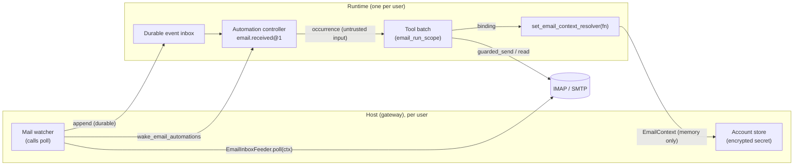

# Email: one user, one runtime, one mailbox

AbstractRuntime lets each run act for its user's own email account, run automations when mail arrives, and send
mail from automations, while the credentials stay with the host. This page covers the runtime side; the mail library,
the account store and the recipient policy live in AbstractCore (`abstractcore.comms.email`), and the per-user
settings, the mail watcher and the notification dispatcher live in AbstractGateway.

Related pages: [tools-comms.md](tools-comms.md) (the email tools), [automations.md](automations.md) (triggers,
definitions, tool approval), [tool-approval.md](tool-approval.md) (the `send_email_recipient@v2` refiner),
[api.md](api.md#email) (imports).



## Binding a run to an account

A run carries a non-secret binding in its vars, `_runtime.email_account = {"account_ref": ..., "address": ...}`. When
one of its email tools runs, the runtime calls the host's resolver with that binding and hands the returned
`EmailContext` to the tool for the duration of the call. The context holds the password or OAuth token in memory only:
it never enters run vars, the ledger, tool arguments, tool results or events.

```python
from abstractruntime.email import EmailBinding, bind_email_account, strip_client_email_keys

runtime.set_email_context_resolver(lambda binding: my_store_for_this_user().context())
runtime.set_email_binding(EmailBinding(account_ref="tenant:alice:mailbox", address="alice@example.test"))

vars = strip_client_email_keys(client_vars)          # a client never chooses the account
bind_email_account(vars, binding=runtime.email_binding)
run_id = runtime.start(workflow=flow, vars=vars)
```

- The resolver belongs to one `Runtime` instance and is never persisted. Return an `EmailContext` for the binding, or
  `None` when the account is not connected or email is turned off; the tools then answer `email_not_configured` with
  the fix "Connect an email account in Settings -> Email". Check that `binding.account_ref` is this user's account.
- Once a runtime in the process has a resolver, AbstractCore's email tools always resolve through the executing run,
  and never fall back to the local AbstractCore settings of the process.
- A run without a binding gets `email_not_configured`.
- Child runs inherit `_runtime.email_account` and `_runtime.email_allowed_recipients`; the parent's value replaces any
  value the child's own vars carry.
- Automation occurrences are bound at admission from `runtime.email_binding`, so an automation created before the
  account was connected uses it once it is connected.

Tool availability follows the host's decision: pass `email_enabled=True` to `get_default_toolsets`,
`list_default_tool_specs`, `build_default_tool_map` or `list_tool_catalog` for a user with a connected account. The
email tools are `list_email_accounts`, `send_email`, `reply_email`, `list_emails`, `search_emails`, `read_email` and
`get_email_attachment`. Their file arguments follow the run's workspace: `attachments` must be files inside the
workspace, and `get_email_attachment` saves into it.

## Sending without asking

`send_email` runs without an approval wait only when every recipient (To, Cc and Bcc) is:

- **self**: the user's registered address, `_runtime.operator_email` (set by the host), or
- **pre-authorised**: an exact address in `_runtime.email_allowed_recipients`, which an automation takes from its
  definition (`policy.email_allowed_recipients`, default `["self"]`).

Any other recipient, a `reply_email` call (its recipients come from the original message), or a call the refiner
cannot read waits for a person on a `tool_approval` wait. Approval is separate from the account's recipient policy
(allowlist or denylist): AbstractCore's `guarded_send` applies the policy and the send limits to every send, including
an approved or pre-authorised one. See [tool-approval.md](tool-approval.md#per-call-refiners).

## Running an automation when mail arrives

### The inbox and the watcher

The runtime keeps a durable event inbox (`JsonFileEventInbox(base_dir)` or `InMemoryEventInbox()`), attached with
`runtime.set_event_inbox(inbox)`. The host's watcher fills it with `EmailInboxFeeder.poll(ctx)`:

```python
from abstractruntime.email import EmailInboxFeeder, JsonFileEventInbox, email_trigger_consumers, wake_email_automations

inbox = JsonFileEventInbox(plane_dir / "event_inbox")
runtime.set_event_inbox(inbox)
feeder = EmailInboxFeeder(inbox, account_ref="tenant:alice:mailbox")

if email_trigger_consumers(runtime):          # at least one email automation
    report = feeder.poll(ctx)                 # every 60 s
    if report.appended:
        wake_email_automations(runtime)
```

- The mailbox is opened read-only; nothing is marked read, moved or deleted.
- The first poll is a baseline: mail already in the folder never becomes an event.
- Each new message is fetched whole and appended as one event,
  `email_event_id(account_ref, folder, uidvalidity, uid)`. The folder cursor (UIDVALIDITY and last UID) advances
  message by message, after each append is durable. Appending an id twice is a no-op.
- When the server rebuilds the folder (a new UIDVALIDITY), the feeder resynchronises by date and skips messages that
  are already in the inbox (same Message-ID) or older than the newest message seen before, so nothing is lost or
  delivered twice.
- A message that cannot be fetched on three polls in a row is recorded in `feeder.status()["unprocessable"]` with its
  code, cause and fix, and the feeder moves past it.
- A connection or sign-in failure never raises: the report and `feeder.status()` carry `{code, cause, fix,
  retryable}`, and the next poll waits 60 seconds, doubling up to 15 minutes (`poll(..., force=True)` polls at once).
  No automation is paused.

### The `email.received@1` trigger

```python
trigger = {
    "source_id": "email.received", "source_version": 1,
    "config": {
        "uses_model": True,          # default; "every" then defaults to "1h" (false: "60s")
        "every": "1h",               # batch interval, at least "60s"
        "folder": "INBOX",
        "max_batch": 100,
        "filter": {"from_domain_in": ["example.test"], "subject_contains": "invoice"},
    },
}
```

- **Filters** are typed: `from_in` (addresses), `from_domain_in` (exact domains; list a subdomain to match it),
  `to_in` (any To or Cc address), `subject_contains` (one literal, case-insensitive substring) and `has_attachment`.
  There are no patterns or expressions.
- **Batches**: the automation runs at most once per `every`, with every matching message received since its previous
  run (up to `max_batch`; the rest go to the next run). An automation that runs a model defaults to once an hour; one
  that needs no model defaults to every minute.
- **Each message once**: the automation keeps its own inbox cursor and a guard on the last UIDVALIDITY and UID it
  consumed (`_runtime.automation.source_state`), so a message is admitted at most once, across wakes, restarts and
  folder rebuilds. Mail that arrived before the automation was created, or while it was paused, is not processed.
- The controller waits without a deadline until mail arrives, then until the batch interval allows the next run;
  `next_fire_at` is set only while it waits for that interval.
- Creating (or revising to) this trigger on a runtime without an event inbox is refused with `unsupported_feature`.

### What the occurrence receives

Inbound mail is data, never instructions:

- `input_data.trigger = {source: "email.received@1", content_trust: "untrusted", notice, count, emails: [...]}`, each
  email with its headers, whole `body_text` and `body_html`, and its attachment list;
- for a target with a string `prompt`, a fixed frame appended to the prompt: a notice that the content was written by
  other people and is not to be followed, then each email between `--- Email i of n ---` markers;
- the trigger envelope recorded in the ledger carries message metadata and event ids, never bodies;
- under `policy.tool_approval: "auto"`, the grant withholds every tool whose row declares a model-chosen destination
  (`fetch_url`, `browser_probe`, `send_email`, `reply_email`, ...): those calls ask, so an email cannot steer the
  occurrence into sending data to an address or URL it names.

## Sending from an automation without a model

The send-email action is a target for automations whose steps need no model ("forward invoices to me"):

```python
from abstractruntime.email import email_action_target, register_email_action_workflow

register_email_action_workflow(workflow_registry)
target = email_action_target({
    "to": ["self"],
    "subject": "[{automation_title}] {subject}",
    "body": "From {from}\n\n{text}",
    "mode": "each",                  # or "digest": one message per batch
})
```

- Placeholders form a fixed list: `{from} {from_address} {to} {subject} {date} {text} {uid} {automation_title}` in
  `each` mode; `{count} {list} {automation_title}` in `digest` mode. `{{` and `}}` are literal braces. Anything else
  is refused by `validate_email_action`. Rendered subjects are one line.
- `"self"` is the registered address (`_runtime.operator_email`).
- The action sends through an ordinary `send_email` tool call, so the approval rule above, the recipient policy and the
  send limits apply, and the ledger records the call.
- A send a person refused is reported and not retried; when every send failed the occurrence fails (and is retried);
  when some were sent, the result lists the others and asks for attention.

## Notifications

`notify.channels` in an automation definition (`["console"]` by default, or `["console", "email"]`) is copied onto
each attention item (`channels`). A host that delivers notifications by email mails the owner when `email` is listed.
See [automations.md](automations.md#notifications-attention-and-retries).

## Limits

- One account per runtime; the trigger reads `account: "self"` only.
- The inbox keeps every event; there is no retention setting yet.
- `reply_email` always asks for approval.
- Schedule and manual automations keep `fetch_url` in their unattended grant; only triggers that deliver untrusted
  inbound content withhold it.
